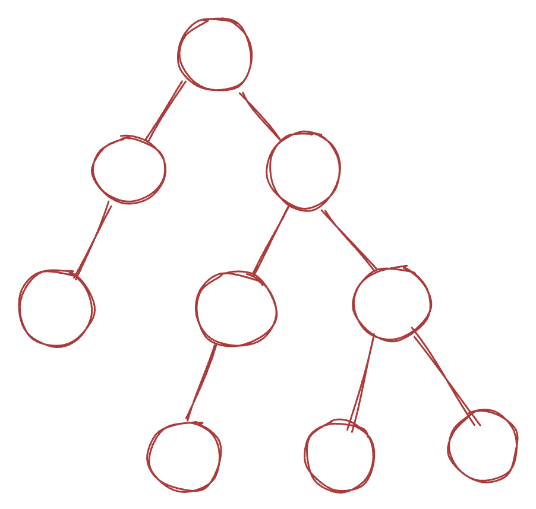
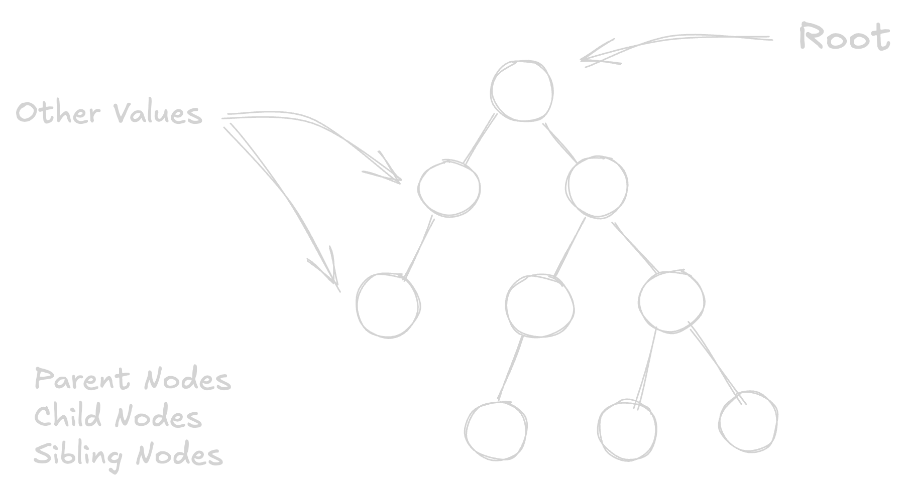
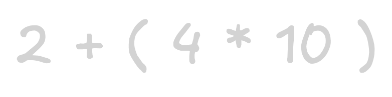
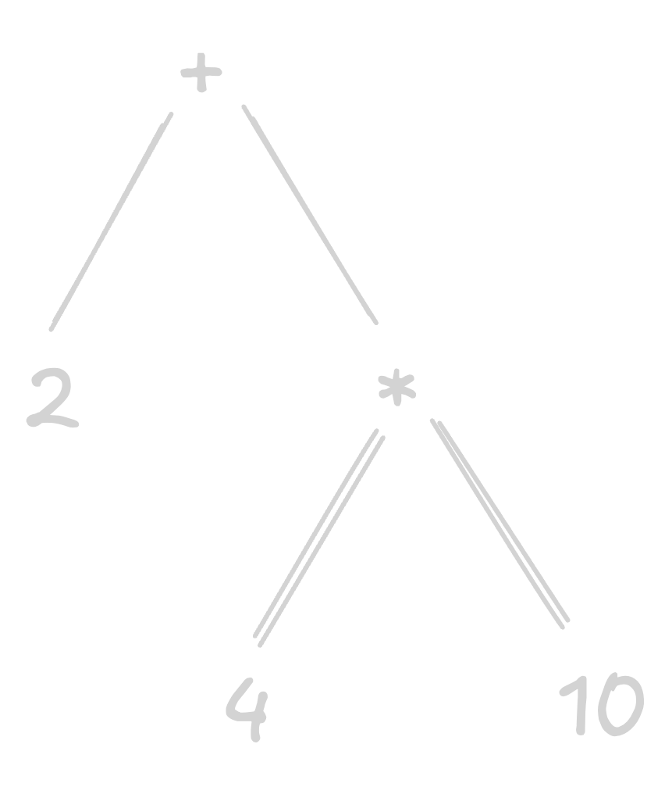
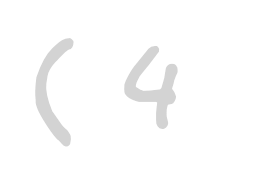
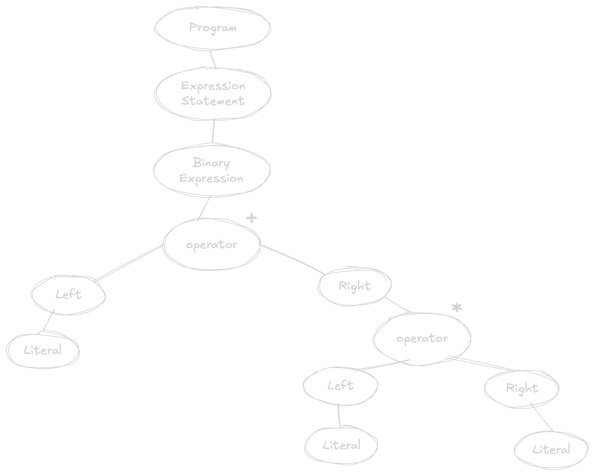
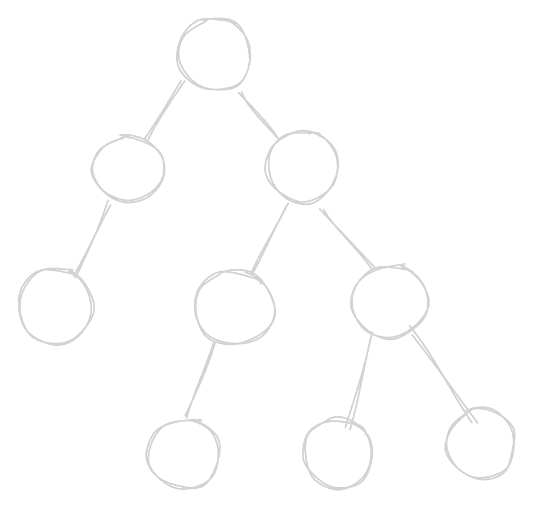

<!-- Slide 1 -->
<div class="text-left text-6xl font-semibold">Abstract<br>Syntax Tree</div>
<div class="text-left text-xl mt-6">Beyond Theory</div>


<style>
  .slidev-layout::before {
    content: '';
    position: absolute;
    top: 0;
    left: 0;
    width: 100%;
    height: 100%;
    background: url('../assets/background.avif') no-repeat center center / cover;
    filter: blur(30px) brightness(0.7);
    z-index: -1;
    animation: bgAnimation 7s infinite alternate;
    animation-timing-function: ease-in-out;
  }

  @keyframes bgAnimation {
    0% {
      filter: blur(30px) brightness(0.3);
    }
    25% {
      filter: blur(30px) brightness(0.8);
    }
    50% {
      filter: blur(30px) brightness(0.5);
    }
    75% {
      filter: blur(30px) brightness(1);
    }
    100% {
      filter: blur(30px) brightness(0.4);
    }
  }

  .bg {
    position: absolute;
    top: 8%;
    right: -10%;
    width: 50%;
    z-index: -1;
    filter: brightness(0.8);
    scale: 1.2;
  }
</style>

---

<!-- Slide 2 -->
<div class="text-center text-4xl font-semibold">Table of Contents</div>

<div v-click="1" class="flex justify-center items-center h-full">
  <div class="grid grid-cols-2 gap-20 w-full p-10">
    <div class="bullet text-2xl">What is AST?</div>
    <div class="bullet text-2xl">Why AST matters?</div>
    <div class="bullet text-2xl">Exploring AST</div>
    <div class="bullet text-2xl">AST in Practice</div>
    <div class="bullet text-2xl">Case Study</div>
    <div class="bullet text-2xl">Conclusion</div>
  </div>
</div>

<style>
  .bullet {
    display: flex; /* Use flexbox for alignment */
    align-items: center; /* Center align items vertically */
  }

  .bullet::before {
    content: counter(bullet-counter); 
    counter-increment: bullet-counter;
    display: flex;
    justify-content: center;
    align-items: center;
    margin-right: 20px;
    width: 40px;
    height: 40px;
    border-radius: 7px;
    background: linear-gradient(135deg, #3C136C, #27136B);
    border: 1px solid #4A2B85;
    font-size: 24px;
  }

  /* Initialize the counter */
  .grid {
    counter-reset: bullet-counter; /* Reset the counter for the grid */
  }
</style>

---
transition: slide-up
level: 2
---
<!-- Slide 3 -->
<div class="flex justify-center items-center h-full text-center text-5xl font-semibold">What is AST?</div>

---
transition: fade-out
---
<!-- Slide 4 -->
<div v-click="1" class="text-center text-3xl font-semibold">A tree representation <br>of the syntactic structure of sourcecode</div>
<div v-click="2" class="flex justify-center items-center -translate-x-5 translate-y-12">
  
</div>

---

<!-- Slide 5 -->
<div v-click="1" class="text-center text-3xl font-semibold">Quick Example</div>

<div class="content-wrapper">

  <div v-click="2" class="center-equation">
    
  </div>

  <div class="arrow-container" v-mark="{ at: 3, color: '#fff', type: 'strike-through' }">
    <v-click at="3">
      <div class="arrow-head"/>
    </v-click>
  </div>


  
</div>

<style>
  .slidev-layout {
    display: flex;
    flex-direction: column;
    gap: 20px;
  }

  .content-wrapper {
    display: grid;
    grid-template-columns: 2fr 2fr 3fr;
    gap: 40px;
    height: calc(100% - 60px); /* Adjust based on title height */
  }

  .center-equation {
    display: flex;
    height: 100%;
    justify-content: start;
    align-items: center;
  }

  .arrow-container {
    position: relative;
    display: flex;
    height: 100%;
    justify-content: center;
    align-items: center;
  }

  .arrow-head {
    position: absolute;
    right: -5px;
    width: 0;
    height: 0;
    border-left: 8px solid #fff;
    border-top: 8px solid transparent;
    border-bottom: 8px solid transparent;
  }
</style>


---
transition: slide-left
level: 3
---
<!-- Slide 6 -->
<div class="content-wrapper">
  <div class="center-equation w-1/2">
    
    <v-click at="1"></v-click>
    <v-click at="4"></v-click>
    <v-click at="7"></v-click>
    <v-click at="10"></v-click>
  </div>


````md magic-move {lines: true}
```json
{
  "type": "BinaryExpression",
  "left": {
    "type": "NumericLiteral",
    "value": 2
  }
}
```

```json {*|1-3|4-7}
{
  "type": "BinaryExpression",
  "left": {
    "type": "NumericLiteral",
    "value": 2
  },
  "operator": "+"
}
```

```json {*|1-8|9-13}
{
  "type": "BinaryExpression",
  "left": {
    "type": "NumericLiteral",
    "value": 2
  },
  "operator": "+",
  "right": {
    "type": "BinaryExpression",
    "left": {
      "type": "NumericLiteral",
      "value": 4
    }
  }
}
```

```json {*|1-13|14-15|16-20}
{
  "type": "BinaryExpression",
  "left": {
    "type": "NumericLiteral",
    "value": 2
  },
  "operator": "+",
  "right": {
    "type": "BinaryExpression",
    "left": {
      "type": "NumericLiteral",
      "value": 4
    },
    "operator": "*",
    "right": {
      "type": "NumericLiteral",
      "value": 10
    }
  }
}
```
````
</div>

<style>
  .slidev-layout {
    display: flex;
    flex-direction: column;
    gap: 20px;
  }

  .content-wrapper {
    display: grid;
    grid-template-columns: 1fr 1fr;
    gap: 20px;
    height: 100%;
  }

  .center-equation {
    display: flex;
    height: 100%;
    justify-content: start;
    align-items: center;
  }
</style>

---

<!-- Slide 7 -->
<div class="flex justify-center items-center h-full">
  <v-click at="1"></v-click>
</div>

---
transition: slide-up
level: 4
---
<!-- Slide 8 -->
<div class="flex justify-center items-center h-full text-center text-5xl font-semibold">Why AST Matters?</div>

---

<!-- Slide 9 -->
<div v-click="1" class="text-center text-3xl font-semibold">Compilers</div>

<div class="flex justify-center items-center h-full relative">
  <div v-click="3" class="absolute center left text-2xl font-semibold">High Level<br>Languages</div>
  <Gear v-click="2" :size="100" direction="counterclockwise" :toothCount="8"/>
  <Gear v-click="2" :size="80" direction="clockwise" :toothCount="8"/>
  <div v-click="3" class="absolute center right text-2xl font-semibold">Low Level<br>Languages</div>
</div>

<style>
  .center {
    top: 50%;
    left: 50%;
    transform: translate(-50%, -50%);
  }

  .right {
    left: 80%;
  }

  .left {
    left: 20%;
  }
</style>

---

<!-- Slide 10 -->
<div class="flex justify-center items-center h-full relative gap-10">
  <div v-click="1" class="absolute center left text-2xl font-semibold">XYZ</div>
  <Gear :size="100" direction="counterclockwise" :toothCount="8" />
  <div v-mark="{ at: 2, color: '#fff', type: 'strike-through' }" class="w-1/10"/>
  <div class="w-1/6 flex flex-col items-center justify-between gap-5">
    <div v-click="3" class="text-xl font-semibold ast">AST</div>
    
    <div v-click="3" class="text-xl font-semibold protocol">Protocol</div>
  </div>
  <div v-mark="{ at: 2, color: '#fff', type: 'strike-through' }" class="w-1/10"/>
  <Gear :size="80" direction="clockwise" :toothCount="8"/>
  <div v-click="1" class="absolute center right text-2xl font-semibold">123</div>
</div>

<style>
  .ast {
    transform: translateX(-30%);
  }

  .protocol {
    transform: translateX(-10%);
  }

  .center {
    top: 50%;
    left: 50%;
    transform: translate(-50%, -50%);
  }

  .right {
    left: 95%;
  }

  .left {
    left: 5%;
  }
</style>

---

<!-- Slide 11 -->
<div class="grid grid-cols-4 gap-10 h-full place-items-center">
  <div class="flex flex-col items-center justify-between gap-10">
    <v-click at="1"></v-click>
    <v-click at="2">
      <div class="text-center text-2xl font-semibold">Linting</div>
    </v-click>
  </div>
  <div class="flex flex-col items-center justify-between gap-10">
    <v-click at="3"></v-click>
    <v-click at="4">
      <div class="text-center text-2xl font-semibold">Formatting</div>
    </v-click>
  </div>
  <div class="flex flex-col items-center justify-between gap-20">
    <v-click at="5"></v-click>
    <v-click at="6">
      <div class="text-center text-2xl font-semibold">Transpiling</div>
    </v-click>
  </div>
  <div class="flex flex-col items-center justify-between gap-32">
    <v-click at="7"><div class="text-center text-3xl font-bold">JSCODESHIFT</div></v-click>
    <v-click at="8">
      <div class="text-center text-2xl font-semibold">Transforming</div>
    </v-click>
  </div>
</div>

---

<!-- Slide 12 -->
<div class="flex justify-center items-center h-full text-center text-5xl font-semibold">Exploring AST</div>

---
clicks: 2
---

<!-- Slide 13 -->
<script setup>
import Timeline from './components/Timeline.vue'
</script>

<div class="text-center text-3xl font-semibold">How does code get transformed to AST?</div>

<div class="flex flex-col items-center gap-10">
  <!-- Title -->
  <div class="text-xl font-bold mb-5 mt-20 text-gray-300 opacity-80">// Code: let x = 42;</div>

  <Timeline ref="timeline" />

  <div 
  v-if="$slidev.nav.currentPage === 13 && $slidev.nav.clicks >= 1" 
  class="hidden"
  @vue:mounted="$refs.timeline?.nextStep()"
  />
  <div 
    v-if="$slidev.nav.currentPage === 13 && $slidev.nav.clicks >= 2" 
    class="hidden"
    @vue:mounted="$refs.timeline?.nextStep()"
  />
</div>

<style>
  @import './style.css';
</style>

---

<!-- Slide 14 -->
<div class="content-wrapper">
  <div class="center-equation w-full">
    <div class="text-2xl font-bold">Common Node Types</div>
  </div>


````md magic-move {lines: true}
```js
// Literal Nodes
"hello" -> { type: 'StringLiteral', value: 'hello' }
42 -> { type: 'NumericLiteral', value: 42 }
```

```js
// Literal Nodes
"hello" -> { type: 'StringLiteral', value: 'hello' }
42 -> { type: 'NumericLiteral', value: 42 }

// Identifier Nodes
x -> { type: 'Identifier', name: 'x' }
```

```js
// Literal Nodes
"hello" -> { type: 'StringLiteral', value: 'hello' }
42 -> { type: 'NumericLiteral', value: 42 }

// Identifier Nodes
x -> { type: 'Identifier', name: 'x' }

// Expression Nodes
2 + 4 -> { 
  type: 'BinaryExpression', 
  operator: '+', 
  left: { type: 'NumericLiteral', value: 2 }, 
  right: { type: 'NumericLiteral', value: 4 } 
}
```

```js
// Literal Nodes
"hello" -> { type: 'StringLiteral', value: 'hello' }
42 -> { type: 'NumericLiteral', value: 42 }

// Identifier Nodes
x -> { type: 'Identifier', name: 'x' }

// Expression Nodes
2 + 4 -> { 
  type: 'BinaryExpression', 
  operator: '+', 
  left: { type: 'NumericLiteral', value: 2 }, 
  right: { type: 'NumericLiteral', value: 4 } 
}

someFunction(x) -> {
  type: 'CallExpression',
  callee: { type: 'Identifier', name: 'someFunction' },
  arguments: [{ type: 'Identifier', name: 'x' }]
}
```

```js
// Literal Nodes
"hello" -> { type: 'StringLiteral', value: 'hello' }
42 -> { type: 'NumericLiteral', value: 42 }

// Identifier Nodes
x -> { type: 'Identifier', name: 'x' }

// Expression Nodes
2 + 4 -> { 
  type: 'BinaryExpression', 
  operator: '+', 
  left: { type: 'NumericLiteral', value: 2 }, 
  right: { type: 'NumericLiteral', value: 4 } 
}

someFunction(x) -> {
  type: 'CallExpression',
  callee: { type: 'Identifier', name: 'someFunction' },
  arguments: [{ type: 'Identifier', name: 'x' }]
}

const x = (y) => x -> {
  type: 'ArrowFunctionExpression',
  params: [{ type: 'Identifier', name: 'y' }],
  body: { type: 'Identifier', name: 'x' }
}
```
````
</div>

<style>
  .slidev-layout {
    display: flex;
    flex-direction: column;
    gap: 20px;
  }

  .content-wrapper {
    display: grid;
    grid-template-columns: 1fr 1fr;
    gap: 20px;
    height: 100%;
  }

  .center-equation {
    display: flex;
    height: 100%;
    justify-content: center;
    align-items: center;
  }
</style>

---

<!-- Slide 15 -->
<div class="flex justify-center items-center text-center text-3xl font-semibold">Tools to Explore AST</div>

<div v-click="1" class="flex flex-col justify-center items-center gap-5 mt-40">
  <a target="_blank" href="https://astexplorer.net/" class="text-xl font-bold">astexplorer.net</a>
  <a target="_blank" href="https://ts-ast-viewer.com/" class="text-xl font-bold">typescript ast viewer</a>
  <a target="_blank" href="https://github.com/estree/estree" class="text-xl font-bold">github.com/estree</a>
</div>

---
transition: slide-left
level: 5
---

<!-- Slide 16 -->
<div class="flex justify-center items-center h-full text-center text-5xl font-semibold">AST in Practice</div>

---

<!-- Slide 17 -->
<div class="flex justify-center items-center h-full relative">
  <div
    v-click="1"
    v-mark="{ at: 12, color: 'orange', type: 'circle' }"
    class="text-xl font-semibold absolute first whitespace-nowrap p-3"
  >ESLint Custom Rules</div>
  <div
    v-click="2"
    class="text-xl font-semibold absolute second whitespace-nowrap"
  >Dead Code Detection</div>
  <div
    v-click="3"
    class="text-xl font-semibold absolute third whitespace-nowrap"
  >Dependency Analysis</div>
  <div
    v-click="4"
    class="text-xl font-semibold absolute fourth whitespace-nowrap"
  >Type Checking</div>
  <div
    v-click="5"
    class="text-xl font-semibold absolute fifth whitespace-nowrap"
  >Style Analysis</div>
  <div
    v-click="6"
    v-mark="{ at: 13, color: 'orange', type: 'circle' }"
    class="text-xl font-semibold absolute sixth whitespace-nowrap p-3"
  >Babel Plugins</div>
  <div
    v-click="7"
    class="text-xl font-semibold absolute seventh whitespace-nowrap"
  >Code Modernization</div>
  <div
    v-click="8"
    class="text-xl font-semibold absolute eighth whitespace-nowrap"
  >Component Analysis</div>
  <div
    v-click="9"
    v-mark="{ at: 14, color: 'orange', type: 'circle' }"
    class="text-xl font-semibold absolute ninth whitespace-nowrap p-3"
  >Code Migration</div>
  <div
    v-click="10"
    class="text-xl font-semibold absolute tenth whitespace-nowrap"
  >Document Generation</div>
  <div
    v-click="11"
    class="text-xl font-semibold absolute eleventh whitespace-nowrap"
  >Typescript Transformers</div>
</div>

<style>
  .first { top: 5%; left: 5%; }
  .second { top: 8%; left: 78%; }
  .third { top: 20%; left: 45%; }
  .fourth { top: 36%; left: 22%; }
  .fifth { top: 49%; left: 52%; }
  .sixth { top: 60%; left: 7%; }
  .seventh { top: 34%; left: 78%; }
  .eighth { top: 95%; left: 24%; }
  .ninth { top: 93%; left: 58%; }
  .tenth { top: 68%; left: 74%; }
  .eleventh { top: 70%; left: 37%; }
</style>

---

<!-- Slide 18 -->
<div
  class="flex justify-center items-center text-center text-4xl font-semibold"
>
  Working with javascript AST
</div>

<div class="flex justify-center items-center w-full h-full relative">
  
  <DrawingArrow v-click="1" class="absolute first" />
  <DrawingArrow v-click="3" class="absolute second" />
  <DrawingArrow v-click="5" class="absolute third" />
  <DrawingArrow v-click="7" class="absolute fourth" />
  <div v-click="2" class="absolute fifth">
    
  </div>
  <div v-click="4" class="absolute sixth">
    
  </div>
  <div v-click="6" class="absolute seventh">
    
  </div>
  <div v-click="8" class="absolute eighth">
    
  </div>
</div>

<style>
  .first {
    top: 8%;
    left: 18%;
    transform: scale(-1, -1);
  }
  .second { 
    top: 50%;
    left: 18%;
    transform: scaleX(-1);
  }
  .third { top: 50%; left: 60%; }
  .fourth {
    top: 8%;
    left: 60%;
    transform: scaleY(-1);
  }
  .fifth { top: 2%; left: 2%; }
  .sixth { bottom: 3%; left: -2%; }
  .seventh { bottom: 3%; right: -23%; }
  .eighth { top: 1%; right: -47%; }
</style>

---

<!-- Slide 19 -->
<div class="content-wrapper">
  <div class="center-equation w-full">
    <div class="text-3xl font-bold">@babel/parser</div>
  </div>


````md magic-move {lines: true}
```js
import fs from 'fs';
import babelParser from '@babel/parser';
```

```js
import fs from 'fs';
import babelParser from '@babel/parser';

const generateAST = (path) => {}
```

```js
import fs from 'fs';
import babelParser from '@babel/parser';

const generateAST = (path) => {
  const code = fs.readFileSync(path, 'utf8');
}
```

```js
import fs from 'fs';
import babelParser from '@babel/parser';

const generateAST = (path) => {
  const code = fs.readFileSync(path, 'utf8');
  return babelParser.parse(code);
}
```

```js
import fs from 'fs';
import babelParser from '@babel/parser';

const generateAST = (path) => {
  const code = fs.readFileSync(path, 'utf8');
  return babelParser.parse(code, {
    sourceType: 'module',
    plugins: ['jsx'],
  });
}
```
````
</div>

<style>
  .slidev-layout {
    display: flex;
    flex-direction: column;
    gap: 20px;
  }

  .content-wrapper {
    display: grid;
    grid-template-columns: 1fr 1fr;
    gap: 20px;
    height: 100%;
    place-items: center;
  }

  .center-equation {
    display: flex;
    height: 100%;
    justify-content: center;
    align-items: center;
  }
</style>

---

<!-- Slide 20 -->
<div class="content-wrapper">
  <div class="center-equation w-full">
    <div class="text-3xl font-bold">@babel/traverse</div>
  </div>


````md magic-move {lines: true}
```js
import babelTraverse from '@babel/traverse';
const { default: traverse } = babelTraverse;
```

```js
import babelTraverse from '@babel/traverse';
const { default: traverse } = babelTraverse;

const traverseImports = (ast) => {}
```

```js
import babelTraverse from '@babel/traverse';
const { default: traverse } = babelTraverse;

const traverseImports = (ast) => {
  const imports = [];
}
```

```js
import babelTraverse from '@babel/traverse';
const { default: traverse } = babelTraverse;

const traverseImports = (ast) => {
  const imports = [];
  const visitor = {}
}
```

```js
import babelTraverse from '@babel/traverse';
const { default: traverse } = babelTraverse;

const traverseImports = (ast) => {
  const imports = [];
  const visitor = {
    // eg. import x from 'y'
    ImportDeclaration: () => {},
    // eg. import('x')
    Import: () => {},
  }
}
```

```js
import babelTraverse from '@babel/traverse';
const { default: traverse } = babelTraverse;

const traverseImports = (ast) => {
  const imports = [];
  const visitor = {
    ImportDeclaration: (path) => {},
    Import: (path) => {},
  }
}
```

```js
import babelTraverse from '@babel/traverse';
const { default: traverse } = babelTraverse;

const traverseImports = (ast) => {
  const imports = [];
  const visitor = {
    ImportDeclaration: (path) => {
      const { node } = path;
    },
    Import: (path) => {
      const { node } = path;
    },
  }
}
```

```js
import babelTraverse from '@babel/traverse';
const { default: traverse } = babelTraverse;

const traverseImports = (ast) => {
  const imports = [];
  const visitor = {
    ImportDeclaration: (path) => {
      const { node } = path;
      imports.push(node.source.value);
    },
    Import: (path) => {
      const { node } = path;
      imports.push(node.arguments[0].value);
    },
  }
}
```

```js
import babelTraverse from '@babel/traverse';
const { default: traverse } = babelTraverse;

const traverseImports = (ast) => {
  const imports = [];
  const visitor = {
    ImportDeclaration: (path) => {
      const { node } = path;
      imports.push(node.source.value);
    },
    Import: (path) => {
      const { node } = path;
      imports.push(node.arguments[0].value);
    },
  }

  traverse(ast, visitor);

  return imports;
}
```
````
</div>

<style>
  .slidev-layout {
    display: flex;
    flex-direction: column;
    gap: 20px;
  }

  .content-wrapper {
    display: grid;
    grid-template-columns: 1fr 1fr;
    gap: 20px;
    height: 100%;
    place-items: center;
  }

  .center-equation {
    display: flex;
    height: 100%;
    justify-content: center;
    align-items: center;
  }
</style>

---

<!-- Slide 21 -->
<div class="content-wrapper">
  <div class="center-equation w-full">
    <div class="text-3xl font-bold">@babel/types</div>
  </div>


````md magic-move {lines: true}
```js
import * as t from '@babel/types';
```

```js
import * as t from '@babel/types';

// Create StringLiteral, BooleanLiteral
const str = t.stringLiteral('hello');
const bool = t.booleanLiteral(true);
```

```js
import * as t from '@babel/types';

// Create StringLiteral, BooleanLiteral
const str = t.stringLiteral('hello');
const bool = t.booleanLiteral(true);

// Create a Identifier
const variableName = t.identifier('world');
```

```js
import * as t from '@babel/types';

// Create StringLiteral, BooleanLiteral
const str = t.stringLiteral('hello');
const bool = t.booleanLiteral(true);

// Create a Identifier
const variableName = t.identifier('world');

// Create a VariableDeclaration
// eg. const world = 'hello'
const variableDeclaration = t.variableDeclaration();
```

```js
import * as t from '@babel/types';

// Create StringLiteral, BooleanLiteral
const str = t.stringLiteral('hello');
const bool = t.booleanLiteral(true);

// Create a Identifier
const variableName = t.identifier('world');

// Create a VariableDeclaration
// eg. const world = 'hello'
const variableDeclaration = t.variableDeclaration(
  'const',
);
```

```js
import * as t from '@babel/types';

// Create StringLiteral, BooleanLiteral
const str = t.stringLiteral('hello');
const bool = t.booleanLiteral(true);

// Create a Identifier
const variableName = t.identifier('world');

// Create a VariableDeclaration
// eg. const world = 'hello'
const variableDeclaration = t.variableDeclaration(
  'const',
  [t.variableDeclarator(variableName, str)],
);
```

```js
import * as t from '@babel/types';

// Create StringLiteral, BooleanLiteral
const str = t.stringLiteral('hello');
const bool = t.booleanLiteral(true);

// Create a Identifier
const variableName = t.identifier('world');

// Create a VariableDeclaration
// eg. const world = 'hello'
const variableDeclaration = t.variableDeclaration(
  'const',
  [t.variableDeclarator(variableName, str)],
);

// Create function world(name) { return `Hello, ${name}!`; }
const functionDeclaration = t.functionDeclaration();
```

```js
import * as t from '@babel/types';

// Create StringLiteral, BooleanLiteral
const str = t.stringLiteral('hello');
const bool = t.booleanLiteral(true);

// Create a Identifier
const variableName = t.identifier('world');

// Create a VariableDeclaration
// eg. const world = 'hello'
const variableDeclaration = t.variableDeclaration(
  'const',
  [t.variableDeclarator(variableName, str)],
);

// Create function world(name) { return `Hello, ${name}!`; }
const functionDeclaration = t.functionDeclaration(
  t.identifier('world'),
);
```

```js
import * as t from '@babel/types';

// Create StringLiteral, BooleanLiteral
const str = t.stringLiteral('hello');
const bool = t.booleanLiteral(true);

// Create a Identifier
const variableName = t.identifier('world');

// Create a VariableDeclaration
// eg. const world = 'hello'
const variableDeclaration = t.variableDeclaration(
  'const',
  t.variableDeclarator(variableName, str),
);

// Create function world(name) { return `Hello, ${name}!`; }
const functionDeclaration = t.functionDeclaration(
  t.identifier('world'),
  [t.identifier('name')],
);
```

```js
import * as t from '@babel/types';

// Create StringLiteral, BooleanLiteral
const str = t.stringLiteral('hello');
const bool = t.booleanLiteral(true);

// Create a Identifier
const variableName = t.identifier('world');

// Create a VariableDeclaration
// eg. const world = 'hello'
const variableDeclaration = t.variableDeclaration(
  'const',
  [t.variableDeclarator(variableName, str)],
);

// Create function world(name) { return `Hello, ${name}!`; }
const functionDeclaration = t.functionDeclaration(
  t.identifier('world'),
  [t.identifier('name')],
  t.blockStatement(),
);
```

```js
import * as t from '@babel/types';

// Create StringLiteral, BooleanLiteral
const str = t.stringLiteral('hello');
const bool = t.booleanLiteral(true);

// Create a Identifier
const variableName = t.identifier('world');

// Create a VariableDeclaration
// eg. const world = 'hello'
const variableDeclaration = t.variableDeclaration(
  'const',
  [t.variableDeclarator(variableName, str)],
);

// Create function world(name) { return `Hello, ${name}!`; }
const functionDeclaration = t.functionDeclaration(
  t.identifier('world'),
  [t.identifier('name')],
  t.blockStatement(
    t.templateLiteral(),
  ),
);
```

```js
import * as t from '@babel/types';

// Create StringLiteral, BooleanLiteral
const str = t.stringLiteral('hello');
const bool = t.booleanLiteral(true);

// Create a Identifier
const variableName = t.identifier('world');

// Create a VariableDeclaration
// eg. const world = 'hello'
const variableDeclaration = t.variableDeclaration(
  'const',
  [t.variableDeclarator(variableName, str)],
);

// Create function world(name) { return `Hello, ${name}!`; }
const functionDeclaration = t.functionDeclaration(
  t.identifier('world'),
  [t.identifier('name')],
  t.blockStatement(
    t.templateLiteral(
      [t.templateElement({ raw: 'Hello, ' }), t.templateElement({ raw: '!' }, true)],
    ),
  ),
);
```

```js
import * as t from '@babel/types';

// Create StringLiteral, BooleanLiteral
const str = t.stringLiteral('hello');
const bool = t.booleanLiteral(true);

// Create a Identifier
const variableName = t.identifier('world');

// Create a VariableDeclaration
// eg. const world = 'hello'
const variableDeclaration = t.variableDeclaration(
  'const',
  [t.variableDeclarator(variableName, str)],
);

// Create function world(name) { return `Hello, ${name}!`; }
const functionDeclaration = t.functionDeclaration(
  t.identifier('world'),
  [t.identifier('name')],
  t.blockStatement(
    t.templateLiteral(
      [t.templateElement({ raw: 'Hello, ' }), t.templateElement({ raw: '!' })],
      [t.identifier('name')],
    ),
  ),
);
```
````
</div>

<style>
  .slidev-layout {
    display: flex;
    flex-direction: column;
    gap: 20px;
  }

  .content-wrapper {
    display: grid;
    grid-template-columns: 1fr 1fr;
    gap: 20px;
    height: 100%;
    place-items: center;
  }

  .center-equation {
    display: flex;
    height: 100%;
    justify-content: center;
    align-items: center;
  }
</style>

---

<!-- Slide 22 -->
<div class="content-wrapper">
  <div class="center-equation w-full">
    <div class="text-3xl font-bold">@babel/generator</div>
  </div>


````md magic-move {lines: true}
```js
import babelGenerator from '@babel/generator';
const { default: generate } = babelGenerator;
```

```js
import babelGenerator from '@babel/generator';
const { default: generate } = babelGenerator;

const generateCode = (ast) => generate(ast).code;
```
````
</div>

<style>
  .slidev-layout {
    display: flex;
    flex-direction: column;
    gap: 20px;
  }

  .content-wrapper {
    display: grid;
    grid-template-columns: 1fr 1fr;
    gap: 20px;
    height: 100%;
    place-items: center;
  }

  .center-equation {
    display: flex;
    height: 100%;
    justify-content: center;
    align-items: center;
  }
</style>

---
transition: slide-up
level: 5
---
<!-- Slide 23 -->
<div class="flex flex-col justify-center items-center h-full text-center text-5xl font-semibold">
  <div>Case Study</div>
  <div class="text-xl mt-4 opacity-70">Styled Components Migration & Post-Transformation</div>
</div>

---
layout: two-cols
---

<!-- Slide 24 -->
# Preface
#### How do we handle RWD ?

<div v-click="1" class="h-full flex justify-start items-center">
````md magic-move {lines: true}
```js
const GENERAL_WIDTH = 375;

// landing會先換算，讓 1rem = 1vw
export const px2Unit = (px) => {
  const unit = (px / GENERAL_WIDTH) * 100;
  return `${unit}rem`;
}
```
````
</div>

<DrawingArrow v-click="2" class="absolute draw-arrow" />

::right::

<div v-click="2" class="h-full flex justify-center items-center">
````md magic-move {lines: true}
```js
import styled from 'styled-components';
import { px2Unit } from './utils';

const StyledComponent = styled.div`
  width: ${px2Unit(100)};
  height: ${px2Unit(100)};

  text-shadow:
    ${px2Unit(-1)} ${px2Unit(-1)} 0 #fff,
    ${px2Unit(1)} ${px2Unit(-1)} 0 #fff,
    ${px2Unit(-1)} ${px2Unit(1)} 0 #fff,
    ${px2Unit(1)} ${px2Unit(1)} 0 #fff;
`;
```
````
</div>

<style>
  .draw-arrow {
    top: 30%;
    left: 40%;
    width: 150px;
    z-index: 100;
    transform: scaleY(-1);
  }
</style>
---

<!-- Slide 25 -->
## Why is this Optimizable?

<div class="flex flex-col gap-4 h-full w-full justify-center items-start pl-20">
  <div v-click="1" class="bullet text-xl">Runtime Performance Issue</div>
  <div v-click="1" class="pl-16">
    <div class="bullet-text">Cost might be high due to excessive and repeated calculation</div>
  </div>
  <div v-click="2" class="bullet text-xl">Bad Developer Experience</div>
  <div v-click="2" class="pl-16">
    <div class="bullet-text">Manually add px2Unit everytime can be verbose and time-consuming</div>
  </div>
  <div v-click="3" class="bullet text-xl">Maintenance Challenges</div>
  <div v-click="3" class="pl-16">
    <div class="bullet-text">Allowing scattered call to px2Unit and can be hard to maintain</div>
  </div>
</div>

<style>
  .bullet {
    display: flex; /* Use flexbox for alignment */
    align-items: center; /* Center align items vertically */
  }

  .bullet-text {
    font-size: 1.2rem;
    line-height: 1.8;

    &::before {
      content: '。';
    }
  }

  .bullet::before {
    content: counter(bullet-counter); 
    counter-increment: bullet-counter;
    display: flex;
    justify-content: center;
    align-items: center;
    margin-right: 20px;
    width: 40px;
    height: 40px;
    border-radius: 7px;
    background: linear-gradient(135deg, #3C136C, #27136B);
    border: 1px solid #4A2B85;
    font-size: 24px;
  }

  .flex {
    counter-reset: bullet-counter; /* Reset the counter for the grid */
  }
</style>

---

<!-- Slide 26 -->

## Solution

<div class="flex flex-col gap-16 h-full w-full justify-center items-start pl-20">
  <div v-click="1" class="bullet text-xl">Runtime to Buildtime transformation</div>
  <div v-click="2" class="bullet text-xl">Current codebase migration</div>
  <div v-click="3" class="bullet text-xl">Future Usage Enforcement</div>
</div>

<style>
  .bullet {
    display: flex; /* Use flexbox for alignment */
    align-items: center; /* Center align items vertically */
  }

  .bullet::before {
    content: counter(bullet-counter); 
    counter-increment: bullet-counter;
    display: flex;
    justify-content: center;
    align-items: center;
    margin-right: 20px;
    width: 40px;
    height: 40px;
    border-radius: 7px;
    background: linear-gradient(135deg, #3C136C, #27136B);
    border: 1px solid #4A2B85;
    font-size: 24px;
  }

  .flex {
    counter-reset: bullet-counter; /* Reset the counter for the grid */
  }
</style>

---

<!-- Slide 27 -->


---

<!-- Slide 28 -->
<div class="flex flex-col justify-center items-center h-full">
  <div class="text-center text-3xl font-bold">Enough talk—let's dive into it</div>
  <div class="flex justify-center items-center">
    <a
      target="_blank"
      href="https://github.com/asde29873012549/ast-demo"
      class="text-sm mt-4 font-bold"
    >
      AST DEMO
    </a>
    <span class="mt-4 mx-4">|</span>
    <a
      target="_blank"
      href="https://github.com/asde29873012549/swc_plugin_styled_px2rem/tree/main"
      class="text-sm mt-4 font-bold"
    >
      SWC_PLUGIN
    </a>
  </div>
</div>

---

<!-- Slide 29 -->

## How do we do the migration?

<div v-click="1" class="flex justify-center items-center h-full">
  <div class="flex flex-col gap-8 w-full pl-20">
    <div v-click="1" class="bullet text-xl">Identify all styled-components.</div>
    <div v-click="2" class="bullet text-xl">Find all px2Unit call inside styled-components.</div>
    <div v-click="3" class="bullet text-xl">Remove all px2Unit call inside styled-components</div>
    <div v-click="4" class="bullet text-xl">Find all JSX expression container that contains px2Unit call</div>
    <div v-click="5" class="bullet text-xl">Remove all px2Unit call inside JSX expression container</div>
    <div v-click="6" class="bullet text-xl">Remove unused px2Unit imports</div>
  </div>
</div>

<style>
  .bullet {
    display: flex; /* Use flexbox for alignment */
    align-items: center; /* Center align items vertically */
  }

  .bullet::before {
    content: counter(bullet-counter); 
    counter-increment: bullet-counter;
    display: flex;
    justify-content: center;
    align-items: center;
    margin-right: 20px;
    width: 40px;
    height: 40px;
    border-radius: 7px;
    background: linear-gradient(135deg, #3C136C, #27136B);
    border: 1px solid #4A2B85;
    font-size: 24px;
  }

  .flex {
    counter-reset: bullet-counter; /* Reset the counter for the grid */
  }
</style>

---

<!-- Slide 30 -->

<div class="flex justify-center items-center h-full text-center text-3xl font-semibold">
  Identifying All Styled-Components
</div>

---

<!-- Slide 31 -->
<div class="flex justify-center items-center text-2xl font-semibold">How Many valid ways to declare a styled-components?</div>
<div class="flex justify-center items-center h-full">
  <div class="grid grid-cols-2 gap-8 w-full pl-20">

<div v-click="1">

````md magic-move {lines: true}
```js
// Basic Tagged Template Literal
```

```js
// Basic Tagged Template Literal
const Components = css``;
```
````
</div>

<div v-click="2">
````md magic-move {lines: true}
```js
// styled object method + Tagged Template Literal
```

```js
// styled object method + Tagged Template Literal
const Components = styled.div``;
```
````
</div>

<div v-click="3">
````md magic-move {lines: true}
```js
// styled function call + Tagged Template Literal
```

```js
// styled function call + Tagged Template Literal
const Components = styled(AnotherComponent)``;
```
````
</div>

<div v-click="4">
````md magic-move {lines: true}
```js
// styled object method function call
```

```js
// styled object method function call
const Components = styled.div(``);
```
````
</div>

<div v-click="5">
````md magic-move {lines: true}
```js
// attributes
```

```js
// attributes
const Components = styled.div.attrs({})``;
```
````
</div>

<div v-click="6">
````md magic-move {lines: true}
```js
// attributes function call
```

```js
// attributes function call
const Components = styled.div.attrs({})(``);
```
````
</div>

  </div>
</div>

---

<!-- Slide 32 -->

<div class="flex justify-center items-center h-full gap-8">
<div class="flex justify-center items-center h-full w-2/5">
```js
// Basic Tagged Template Literal
const Component = css``;
```
</div>

<div class="flex justify-center items-center h-full w-3/5">
  
</div>
</div>

---

<!-- Slide 33 -->

<div class="flex justify-center items-center h-full gap-8">
<div class="flex justify-center items-center h-full w-1/3">
```js
// styled object method
const Component = styled.div``;
```
</div>

<div class="flex justify-center items-center h-full w-2/3">
  
</div>
</div>

---

<!-- Slide 34 -->

<div class="flex justify-center items-center h-full gap-8">
<div class="flex justify-center items-center h-full w-1/3">
```js
// styled function call
const Component = styled(AnotherComponent)``;
```
</div>

<div class="flex justify-center items-center h-full w-2/3">
  
</div>
</div>

---

<!-- Slide 35 -->

<div class="flex justify-center items-center h-full gap-8">
<div class="flex justify-center items-center h-full w-1/3">
```js
// styled object method function call
const Component = styled.div.attrs()``;
```
</div>

<div class="flex justify-center items-center h-full w-2/3">
  
</div>
</div>

---

<!-- Slide 36 -->

<div class="flex w-full h-full justify-center items-center container">
````md magic-move {lines: true}
```js
import { isIdentifier, isMemberExpression, isCallExpression } from '@babel/types';
```

```js
import { isIdentifier, isMemberExpression, isCallExpression } from '@babel/types';

const isStyledTag = (path) => {}
```

```js
import { isIdentifier, isMemberExpression, isCallExpression } from '@babel/types';

const isStyledTag = (path) => {
  const { tag } = path.node || {};
}
```

```js
import { isIdentifier, isMemberExpression, isCallExpression } from '@babel/types';

const isStyledTag = (path) => {
  const { tag } = path.node || {};
  if (!tag) return false;
}
```

```js
import { isIdentifier, isMemberExpression, isCallExpression } from '@babel/types';

const isStyledTag = (path) => {
  const { tag } = path.node || {};
  if (!tag) return false;
  // Handle css``

  // Handle styled.div``

  //Handle styled(AnotherComponent)``
}
```

```js
import { isIdentifier, isMemberExpression, isCallExpression } from '@babel/types';

// options: styled, css, createGlobalStyle, keyframes
const isStyledIdentifier = (identifier) => STYLED_TAGS.includes(identifier.name);

const isStyledTag = (path) => {
  const { tag } = path.node || {};
  if (!tag) return false;
  // Handle css``
  if (isIdentifier(tag)) return isStyledIdentifier(tag);
  // Handle styled.div``

  //Handle styled(AnotherComponent)``
}
```

```js
import { isIdentifier, isMemberExpression, isCallExpression } from '@babel/types';

const isStyledIdentifier = (identifier) => STYLED_TAGS.includes(identifier.name);

const isStyledMember = (member) => {
  if (isIdentifier(member.object)) return isStyledIdentifier(member.object);
  if (isMemberExpression(member.object)) return isStyledMember(member.object);
  return false;
};

const isStyledTag = (path) => {
  const { tag } = path.node || {};
  if (!tag) return false;
  // Handle css``
  if (isIdentifier(tag)) return isStyledIdentifier(tag);
  // Handle styled.div``
  if (isMemberExpression(tag)) return isStyledMember(tag);
  //Handle styled(AnotherComponent)``
}
```

```js
import { isIdentifier, isMemberExpression, isCallExpression } from '@babel/types';

const isStyledIdentifier = (identifier) => STYLED_TAGS.includes(identifier.name);

const isStyledMember = (member) => {
  if (isIdentifier(member.object)) return isStyledIdentifier(member.object);
  if (isMemberExpression(member.object)) return isStyledMember(member.object);
  return false;
};

const isStyledFunction = (callExpression) => {
  const { callee } = callExpression;
  if (isIdentifier(callee)) return isStyledIdentifier(callee);
  if (isMemberExpression(callee)) return isStyledMember(callee);
  if (isCallExpression(callee)) return isStyledFunction(callee);
  return false;
};

const isStyledTag = (path) => {
  const { tag } = path.node || {};
  if (!tag) return false;
  // Handle css``
  if (isIdentifier(tag)) return isStyledIdentifier(tag);
  // Handle styled.div``
  if (isMemberExpression(tag)) return isStyledMember(tag);
  //Handle styled(AnotherComponent)``
  if (isCallExpression(tag)) return isStyledFunction(tag);
  return false;
}
```

````

</div>

---
layout: center
---
<!-- Slide 37 -->

<div class="flex justify-center items-center h-full text-center text-3xl font-semibold">
  Finding all px2Unit call inside styled-components
</div>

---

<!-- Slide 38 -->
<div class="flex justify-center items-center text-2xl font-semibold">How Many ways to use px2Unit inside styled-components?</div>
<div class="flex justify-center items-center h-full">
  <div class="grid grid-cols-2 gap-4 w-full">

<div v-click="1">

````md magic-move {lines: true}
```js
// Direct call
```

```js
// Direct call
const Components = styled.div`
  width: ${px2Unit(2)};
`;
```
````
</div>

<div v-click="2">
````md magic-move {lines: true}
```js
// Anything except direct call
```

```js
// Anything except direct call
const Components = styled.div`
  width: ${({ x }) => x ? px2Unit(x) : '5px'};
`;
```

```js
// Anything except direct call
const Components = styled.div`
  width: ${({ x }) => x ? px2Unit(x) : '5px'};
`;

const Components = styled.div`
  width: ${({ x }) => px2Unit(x) || '5px'};
`;
```

```js
// Anything except direct call
const Components = styled.div`
  width: ${({ x }) => width ? px2Unit(x) : '5px'};
`;

const Components = styled.div`
  width: ${({ x }) => px2Unit(x) || '5px'};
`;

const Components = styled.div`
  width: ${() => {
    const x = px2Unit(2);
    return x;
  }};
`;


```
````
</div>

  </div>
</div>

---

<!-- Slide 39 -->

<div class="flex justify-center items-center h-full gap-8">
<div class="flex justify-center items-center h-full w-3/10">
```js
// TaggedTemplateLiteral
export default styled(AnotherComponent)`
  width: ${px2Unit(2)};
  height: 300px;
  margin: ${px2Unit(30)};
`
```
</div>

<div class="flex justify-center items-center h-full w-7/10">
  
</div>
</div>

---

<!-- Slide 40 -->

<div class="flex justify-center items-center h-full gap-8">
<div class="flex justify-center items-center h-full w-3/10">
```js
// TaggedTemplateLiteral
export default styled(AnotherComponent)`
  width: ${() => {
    const width = px2Unit(2)
    return width
  }};
  height: 300px;
  margin: ${px2Unit(30)};
`
```
</div>

<div class="flex justify-center items-center h-full w-7/10 relative">
  
  
</div>
</div>

---

<!-- Slide 41 -->
````md magic-move {lines: true}
```js
{
  TaggedTemplateExpression: () => {}
}
```

```js
{
  TaggedTemplateExpression: (path) => {
    if (!isStyledTag(path)) return;
  }
}
```

```js
{
  TaggedTemplateExpression: (path) => {
    if (!isStyledTag(path)) return;
    const templateLiteralPath = path.get("quasi");
  }
}
```

```js
import { isCallExpression } from '@babel/types';
const isPx2UnitCall = (expression) => expression.callee?.name === "px2Unit";

{
  TaggedTemplateExpression: (path) => {
    if (!isStyledTag(path)) return;
    const templateLiteralPath = path.get("quasi");
    const { quasis, expressions } = templateLiteralPath.node;

    expressions.forEach((expressionPath, i) => {
      if (isCallExpression(expressionPath) && isPx2UnitCall(expressionPath)) {
        // Replace the expression with px2Unit value
      }
    })
  }
}
```

```js
import { isCallExpression } from '@babel/types';
const isPx2UnitCall = (expression) => expression.callee?.name === "px2Unit";

{
  TaggedTemplateExpression: (path) => {
    if (!isStyledTag(path)) return;
    const templateLiteralPath = path.get("quasi");
    const { quasis, expressions } = templateLiteralPath.node;

    expressions.forEach((expressionPath, i) => {
      if (isCallExpression(expressionPath) && isPx2UnitCall(expressionPath)) {
        // Replace the expression with px2Unit value
      } else {
        expressionPath.traverse({
          CallExpression: (callExpressionPath) => {
            if (isPx2UnitCall(callExpressionPath)) {
              // Replace the expression with px2Unit value
            }
          }
        })
      }
    })
  }
}
```
````

---

<!-- Slide 42 -->
<div class="flex justify-center items-center h-full text-center text-3xl font-semibold">
  Removing all px2Unit call from styled-components
</div>

---

<!-- Slide 43 -->

<div class="flex justify-center items-center h-full">
  <div class="grid grid-cols-2 w-full gap-8">
    <div v-click="1" class="flex justify-center items-center">

````md magic-move {lines: true}
```js
const transformDirectCall = () => {}
```

```js
// Handle Direct px2Unit Call
const transformDirectCall = (
  exprPath,
  quasiPath,
  prevQuasi,
  nextQuasi
) => {
  if (!nextQuasi) return;
  const [arg] = exprPath.node.arguments;

  if (isPureLiteral(arg)) {
    const val = `${arg.value}px`;
    const nextVal = nextQuasi.value;
    prevQuasi.value.raw += `${val}${nextVal.raw}`;
    prevQuasi.value.cooked += `${val}${nextVal.cooked}`;
    // Remove the merged nextQuasi and the expression
    quasiPath.remove();
    exprPath.remove();
  }
  // Handle dynamic expressions eg. ${px2Unit(size)}
  if (isPureExpression(arg)) {
    exprPath.replaceWith(arg);
    // Prefix 'px' to the next quasi
    const nextVal = nextQuasi.value;
    nextQuasi.value.raw = `px${nextVal.raw}`;
    nextQuasi.value.cooked = `px${nextVal.cooked}`;
  }
}
```
````
</div>

  <div v-click="2" class="flex justify-center items-center">
````md magic-move {lines: true}
```js
const transformDynamicCall = () => {}
```

```js
const isPx2UnitCall = (expression) =>
  expression.callee?.name === "px2Unit";

// Handle All other cases
const transformDynamicCall = (exprPath) => {
  const getReplaceNode = (arg) =>
    isNumericLiteral(arg)
      ? stringLiteral(`${arg.value}px`)
      : createTemplateLiteral(arg);

  exprPath.traverse({
    CallExpression: (callExprPath) => {
      if (!isPx2UnitCall(callExprPath.node))
        return;

      const [arg] = callExprPath.node.arguments;
      // Replace px2Unit call with either:
      // 1. A string literal (e.g. "10px")
      // 2. Dynamic values (e.g. `${width}px`)
      callExprPath.replaceWith(
        getReplaceNode(arg)
      );
    },
  });
}
```
````
    </div>
  </div>
</div>

---

<!-- Slide 44 -->
````md magic-move {lines: true}
```js
import { isCallExpression } from '@babel/types';
const isPx2UnitCall = (expression) =>
  expression.callee?.name === "px2Unit";

{
  TaggedTemplateExpression: (path) => {
    if (!isStyledTag(path)) return;
    const templateLiteralPath = path.get("quasi");
    const { quasis, expressions } = templateLiteralPath.node;

    expressions.forEach((expressionPath, i) => {
      if (isCallExpression(expressionPath) && isPx2UnitCall(expressionPath)) {
        // Replace the expression with px2Unit value
      } else {
        expressionPath.traverse({
          CallExpression: (callExpressionPath) => {
            if (isPx2UnitCall(callExpressionPath)) {
              // Replace the expression with px2Unit value
            }
          }
        })
      }
    })
  }
}
```

```js
const isPx2UnitCall = (expression) =>
  expression.callee?.name === "px2Unit";

{
  TaggedTemplateExpression: (path) => {
    if (!isStyledTag(path)) return;
    const templateLiteralPath = path.get("quasi");
    const { quasis, expressions } = templateLiteralPath.node;

    expressions.forEach((expressionPath, i) => {
      const quasiPath = templateLiteralPath.get(`quasis.${i + 1}`);
      if (isCallExpression(expressionPath) && isPx2UnitCall(expressionPath)) {
        // Replace the expression with px2Unit value
        transformDirectCall(expressionPath, quasiPath, quasis[i], quasis[i + 1]);
      } else {
        expressionPath.traverse({
          CallExpression: (callExpressionPath) => {
            if (isPx2UnitCall(callExpressionPath)) {
              // Replace the expression with px2Unit value
            }
          }
        })
      }
    })
  }
}
```

```js
const isPx2UnitCall = (expression) =>
  expression.callee?.name === "px2Unit";

{
  TaggedTemplateExpression: (path) => {
    if (!isStyledTag(path)) return;
    const templateLiteralPath = path.get("quasi");
    const { quasis, expressions } = templateLiteralPath.node;

    expressions.forEach((expressionPath, i) => {
      const quasiPath = templateLiteralPath.get(`quasis.${i + 1}`);
      if (isCallExpression(expressionPath) && isPx2UnitCall(expressionPath)) {
        // Replace the expression with px2Unit value
        transformDirectCall(expressionPath, quasiPath, quasis[i], quasis[i + 1]);
      } else {
        transformDynamicCall(expressionPath);
      }
    })
  }
}
```

```js
const isPx2UnitCall = (expression) =>
  expression.callee?.name === "px2Unit";

{
  TaggedTemplateExpression: (path) => {
    if (!isStyledTag(path)) return;
    const templateLiteralPath = path.get("quasi");
    transformTemplate(templateLiteralPath);
  }
}
```

```js
const transformTemplate = (templateLiteralPath) => {
  const { quasis, expressions } = templateLiteralPath.node;

  expressions.forEach((expr, i) => {
    const exprPath = templateLiteralPath.get(`expressions.${i}`);
    const quasiPath = templateLiteralPath.get(`quasis.${i + 1}`);

    if (isCallExpression(expr) && isPx2UnitCall(expr)) {
      transformDirectPx2UnitCall(exprPath, quasiPath, quasis[i], quasi);
    } else {
      transformDynamicCall(exprPath);
    }
  })
};
```
````

---

<!-- Slide 45 -->
<div class="flex justify-center items-center h-full text-center text-3xl font-semibold">
  Finding All JSX expression container that contains px2Unit call
</div>
---

<!-- Slide 46 -->
````md magic-move {lines: true}
```js
{
  JSXExpressionContainer: () => {}
}
```

```js
{
  JSXExpressionContainer: (jsxExpressionPath) => {
    jsxExpressionPath.traverse()
  }
}
```

```js
{
  JSXExpressionContainer: (jsxExpressionPath) => {
    jsxExpressionPath.traverse({
      CallExpression: (callExpressionPath) => {}
    })
  }
}
```

```js
const isPx2UnitCall = (expression) => expression.callee?.name === "px2Unit";

{
  JSXExpressionContainer: (jsxExpressionPath) => {
    jsxExpressionPath.traverse({
      CallExpression: (callExpressionPath) => {
        if (isPx2UnitCall(jsxContainerPath.node.expression)) {
          // handle direct px2Unit call eg. width={px2Unit(10)}
        }
      }
    })
  }
}
```

```js
import { isNumericLiteral, isStringLiteral, stringLiteral } from '@babel/types';
const isPureLiteral = (expression) => isNumericLiteral(expression) || isStringLiteral(expression);
const isPx2UnitCall = (expression) => expression.callee?.name === "px2Unit";

{
  JSXExpressionContainer: (jsxExpressionPath) => {
    jsxExpressionPath.traverse({
      CallExpression: (callExpressionPath) => {
        if (isPx2UnitCall(jsxContainerPath.node.expression)) {
          // handle direct px2Unit call eg. width={px2Unit(10)}
        } else if (isTemplateLiteral(jsxContainerPath.node.expression)) {
          // handle px2Unit call inside template literal eg. margin={`${px2Unit(10)} ${px2Unit(20)}`}
        }
      }
    })
  }
}
```

```js
import { isNumericLiteral, isStringLiteral, stringLiteral } from '@babel/types';
const isPureLiteral = (expression) => isNumericLiteral(expression) || isStringLiteral(expression);
const isPx2UnitCall = (expression) => expression.callee?.name === "px2Unit";

{
  JSXExpressionContainer: (jsxExpressionPath) => {
    jsxExpressionPath.traverse({
      CallExpression: (callExpressionPath) => {
        if (isPx2UnitCall(jsxContainerPath.node.expression)) {
          // handle direct px2Unit call eg. width={px2Unit(10)}
        } else if (isTemplateLiteral(jsxContainerPath.node.expression)) {
          // handle px2Unit call inside template literal eg. margin={`${px2Unit(10)} ${px2Unit(20)}`}
        } else {
          // handle all other complex expressions
        }
      }
    })
  }
}
```
````
---

<!-- Slide 47 -->
<div class="flex justify-center items-center h-full text-center text-3xl font-semibold">
  Remove all JSX expression container that contains px2Unit call
</div>

---

<!-- Slide 48 -->

````md magic-move {lines: true}
```js
const transformJSXContainer = (jsxContainerPath, arg) => {
  // Handle pure literals cases: eg. string or numeric literals
  // transform  width={px2Unit(10)} to width="10px"
  if (isPureLiteral(arg)) {
    jsxContainerPath.replaceWith(stringLiteral(`${arg.value}px`));
    return;
  }
};
```

```js
const transformJSXContainer = (jsxContainerPath, arg) => {
  // Handle pure literals cases: eg. string or numeric literals
  // transform  width={px2Unit(10)} to width="10px"
  if (isPureLiteral(arg)) {
    jsxContainerPath.replaceWith(stringLiteral(`${arg.value}px`));
    return;
  }

  // Handle all other expressions cases
  // transform width={px2Unit(bigSize)} to width={`${bigSize}px`}
  if (isPureExpression(arg)) {
    const exprPath = jsxContainerPath.get("expression");
    exprPath.replaceWith(createTemplateLiteral(arg));
    return;
  }
};
```
````

---

<!-- Slide 49 -->
````md magic-move {lines: true}
```js
const transformTemplate = (templateLiteralPath) => {
  const { quasis, expressions } = templateLiteralPath.node;

  expressions.forEach((expr, i) => {
    const exprPath = templateLiteralPath.get(`expressions.${i}`);
    const quasiPath = templateLiteralPath.get(`quasis.${i + 1}`);

    if (isCallExpression(expr) && isPx2UnitCall(expr)) {
      transformDirectPx2UnitCall(exprPath, quasiPath, quasis[i], quasi);
    } else {
      transformDynamicCall(exprPath);
    }
  })
};
```
````

---

<!-- Slide 50 -->
````md magic-move {lines: true}
```js
const transformDynamicCall = (exprPath) => {
  const getReplaceNode = (arg) =>
    isNumericLiteral(arg)
      ? stringLiteral(`${arg.value}px`)
      : createTemplateLiteral(arg);

  exprPath.traverse({
    CallExpression: (callExprPath) => {
      if (!isPx2UnitCall(callExprPath.node)) return;

      const [arg] = callExprPath.node.arguments;
      // Replace px2Unit call with either:
      // 1. A string literal (e.g. "10px")
      // 2. Dynamic values (e.g. `${width}px`)
      callExprPath.replaceWith(getReplaceNode(arg));
    },
  });
}
```
````

---

<!-- Slide 51 -->
````md magic-move {lines: true}
```js
import { isNumericLiteral, isStringLiteral, stringLiteral } from '@babel/types';
const isPureLiteral = (expression) => isNumericLiteral(expression) || isStringLiteral(expression);
const isPx2UnitCall = (expression) => expression.callee?.name === "px2Unit";

{
  JSXExpressionContainer: (jsxExpressionPath) => {
    jsxExpressionPath.traverse({
      CallExpression: (callExpressionPath) => {
        if (isPx2UnitCall(jsxContainerPath.node.expression)) {
          // handle direct px2Unit call eg. width={px2Unit(10)}
        } else if (isTemplateLiteral(jsxContainerPath.node.expression)) {
          // handle px2Unit call inside template literal eg. margin={`${px2Unit(10)} ${px2Unit(20)}`}
        } else {
          // handle all other complex expressions
        }
      }
    })
  }
}
```

```js
import { isNumericLiteral, isStringLiteral, stringLiteral } from '@babel/types';
const isPureLiteral = (expression) => isNumericLiteral(expression) || isStringLiteral(expression);
const isPx2UnitCall = (expression) => expression.callee?.name === "px2Unit";

{
  JSXExpressionContainer: (jsxExpressionPath) => {
    jsxExpressionPath.traverse({
      CallExpression: (callExpressionPath) => {
        if (isPx2UnitCall(jsxContainerPath.node.expression)) {
          // handle direct px2Unit call eg. width={px2Unit(10)}
          const [arg] = callExprPath.node.arguments;
          transformJSXContainer(jsxContainerPath, arg);
        } else if (isTemplateLiteral(jsxContainerPath.node.expression)) {
          // handle px2Unit call inside template literal eg. margin={`${px2Unit(10)} ${px2Unit(20)}`}
          const templateLiteralPath = jsxContainerPath.get("expression");
          transformTemplate(templateLiteralPath);
        } else {
          // handle all other complex expressions
          transformDynamicCall(callExpressionPath);
        }
      }
    })
  }
}
```
````

---
transition: slide-up
level: 4
---
<!-- Slide 52 -->
<div class="flex justify-center items-center h-full text-center text-5xl font-semibold">CONCLUSION</div>

---

<!-- Slide 53 -->
<div class="flex justify-center items-center h-full text-center text-xl font-semibold">
  AST can be intimidating and tricky as you first sees it,
  <br />
  but it can be extemely powerful if you know how to harness its power.
</div>

---
layout: center
class: text-center
---

<!-- Slide 54 -->
<div class="flex flex-col justify-center items-center h-full text-center font-semibold">
  <div class="text-6xl">Thanks!</div>
  <div class="text-md mt-4">Q&A</div>
</div>
